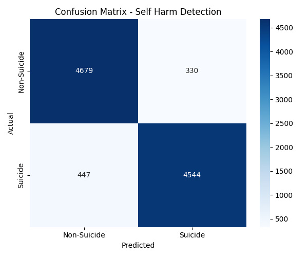

# 🧠 Self-Harm Detection System
### AI-Based Detection Using Behavioral & Physiological Indicators

> **Project 34 | 2nd Year AIML Mini Project**  
> **Team:** Avani Upadhyay | Archit Agrawal

---

## 📌 Problem Statement
Self-harm is a critical mental health concern that often remains undetected due to stigma, lack of visible symptoms, and limited access to timely support. This system uses **multimodal AI** to analyze behavioral and physiological signals to identify at-risk individuals and trigger timely alerts.

---

## 🎯 Key Objectives
- Detect early indicators of self-harm risk using AI/ML
- Enable timely intervention by mental health professionals
- Preserve user privacy and confidentiality
- Support caregivers and mental health support systems

---

## ⚙️ System Architecture & Workflow
```
Data Collection → Preprocessing → Feature Extraction → 
Model Training → Evaluation → Flask API → Alert Generation
```
```
Self-harm-detection/
│
├── backend/
│   ├── app.py                  ← Flask REST API
│   ├── model/
│   │   └── train_model.py      ← ML model training
│   ├── utils/
│   │   └── preprocess.py       ← Text preprocessing
│   └── data/
│       └── README.md           ← Dataset instructions
│
├── frontend/
│   ├── index.html              ← Main UI
│   ├── style.css               ← Styling
│   └── scripts.js              ← Frontend logic
│
├── docs/
│   └── confusion_matrix.png    ← Model evaluation chart
│
├── requirements.txt
└── README.md
```

---

## 🛠️ Tech Stack

| Layer | Technology |
|---|---|
| Backend API | Python, Flask |
| Machine Learning | Scikit-learn, NLTK |
| Text Analysis | TF-IDF, VADER Sentiment |
| Data Processing | Pandas, NumPy |
| Frontend | HTML5, CSS3, JavaScript |
| Visualization | Matplotlib, Seaborn |
| Model Persistence | Joblib |

---

## 🤖 ML Model Performance

| Metric | Score |
|---|---|
| Accuracy | **91.8%** |
| Precision | 92% |
| Recall | 92% |
| F1-Score | 0.92 |
| CV F1 Score | 0.9142 |

### Confusion Matrix


---

## 📡 API Endpoints

| Method | Endpoint | Description |
|---|---|---|
| GET | `/api/health` | Check API status |
| POST | `/api/predict` | Predict risk from text |
| GET | `/api/stats` | Get prediction statistics |

### Sample Request
```json
POST /api/predict
{
  "text": "I feel completely hopeless and nobody cares"
}
```

### Sample Response
```json
{
  "alert_triggered": true,
  "confidence": 0.6953,
  "message": "High risk indicators detected.",
  "risk_level": "HIGH",
  "sentiment_score": -0.5617
}
```

---

## 🚀 Setup & Installation

### Step 1: Clone the Repository
```bash
git clone https://github.com/Architcybercrime/Self-harm-detection.git
cd Self-harm-detection
```

### Step 2: Install Dependencies
```bash
pip install -r requirements.txt
```

### Step 3: Download Dataset
Download from Kaggle and place in `backend/data/`:
- Link: https://www.kaggle.com/datasets/nikhileswarkomati/suicide-watch
- Filename: `Suicide_Detection.csv`

### Step 4: Train the Model
```bash
cd backend
python model/train_model.py
```

### Step 5: Run the API
```bash
python app.py
```

### Step 6: Open Frontend
Open `frontend/index.html` in browser with API running.

---

## 🗺️ Future Enhancements
- [ ] Facial expression analysis using DeepFace
- [ ] Speech/audio tone analysis using Librosa
- [ ] Retrain on full 232k dataset for higher accuracy
- [ ] PostgreSQL database for prediction history
- [ ] Docker containerization
- [ ] Cloud deployment on AWS/Azure

---

## ⚠️ Ethical Considerations
- This system is a **support tool only** — not a replacement for professional diagnosis
- No personal data is stored
- Alert system involves human-in-the-loop decision making

---

## 👥 Team

| Name | Role |
|---|---|
| Avani Upadhyay | Frontend Development, UI/UX |
| Archit Agrawal | Backend API, ML Model, Data Pipeline |

---

> *"Early detection saves lives. AI can be a compassionate tool when built responsibly."*